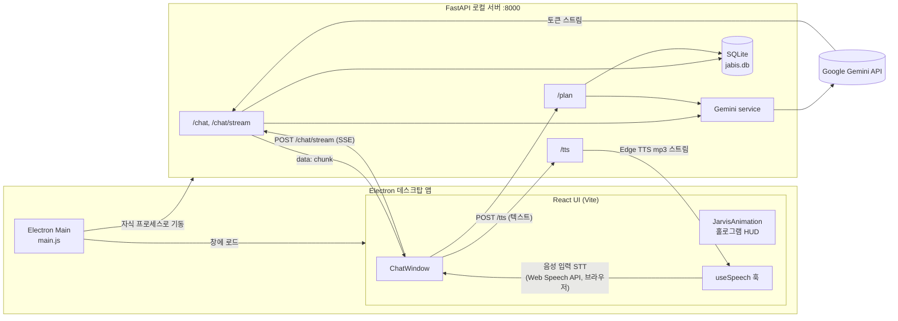

# J.A.B.I.S — Just A Brilliant Intelligence System

> 아이언맨의 자비스에서 영감을 받은 **음성 대화형 AI 학습 비서 데스크탑 앱**.
> 말을 걸면 인식(STT)하고, Gemini가 답하며, 자연스러운 한국어 음성(TTS)으로 읽어준다. 그동안 중앙 홀로그램 HUD가 반응한다.

📅 개발 기간: 2026.03 · 1인 개발

---

## 🎬 데모

<!-- TODO: 실측값 채우기 — 음성 대화 + 홀로그램 HUD 반응이 핵심이므로 GIF가 특히 중요.
     추천 클립: ① 마이크 버튼 → 말하기 → STT 인식 → AI 음성 응답 ② 응답 중 JARVIS HUD 가속/코어 발광 ③ 학습 플랜 생성 -->

🚧 데모 GIF / 스크린샷 측정 필요 — `docs/demo.gif` 추가 후 아래 자리에 삽입

```
[ 여기에 음성 대화 + 홀로그램 HUD 데모 GIF ]
```

---

## 🧩 왜 만들었나 (문제 정의)

텍스트 챗봇은 많지만, **말로 묻고 음성으로 듣는** 학습 경험은 흔치 않다. 화면을 안 보고도 개념을 물어보고, 학습 플랜을 짜고, 답을 귀로 듣는 "비서"를 만들고 싶었다.

기술적으로는 **STT → LLM → TTS**라는 긴 파이프라인을 데스크탑 앱 하나로 묶는 것이 도전이었다. 음성 비서는 응답이 한 박자만 늦어도 대화가 어색해지기 때문에, 파이프라인 각 단계를 어디서 처리하고 어떻게 체감 지연을 줄일지가 핵심 설계 과제였다.

---

## 🛠 기술 스택 & 선정 이유

| 역할 | 기술 | 왜 이걸 골랐나 (핵심 한 줄) |
|------|------|------|
| 데스크탑 셸 | **Electron 32** | 로컬 Python 서버를 자식 프로세스로 띄우고 네이티브 창에 React UI를 담기 위해 — 웹 앱이 아닌 "앱"으로 배포 |
| 프론트엔드 | **React 18 + TypeScript + Vite** | 홀로그램 HUD의 상태(말하는 중/듣는 중) 기반 애니메이션을 선언적으로 다루기 위해 |
| 백엔드 | **Python + FastAPI** | AI/음성 라이브러리 생태계가 Python에 있고, async 스트리밍 응답(SSE)을 간결하게 구현 가능 |
| AI | **Google Gemini** (`google-genai` SDK) | 한국어 품질과 무료 티어, 스트리밍 생성(`generate_content_stream`) 지원 |
| TTS (출력) | **Edge TTS** (`ko-KR-InJoonNeural`) | 브라우저 기본 TTS보다 자연스러운 한국어 음성을 무료로 — 서버에서 mp3 스트림 생성 |
| STT (입력) | **Web Speech API** | 브라우저 내장이라 추가 의존성 없이 한국어 음성 인식 처리 |
| 저장소 | **SQLite + SQLAlchemy** | 1인용 로컬 앱이라 별도 DB 서버 없이 대화·학습 플랜을 파일 하나로 영속화 |

> 설계 의도: **음성 입력은 클라이언트(브라우저 STT), 음성 출력은 서버(Edge TTS)** 로 분리. 입력은 지연이 적은 브라우저에 맡기고, 출력 품질은 서버 TTS로 끌어올리는 역할 분담.

---

## 🏗 시스템 아키텍처



흐름 요약: **사용자 음성 → 브라우저 STT → FastAPI `/chat/stream` → Gemini 스트리밍 → 화면 출력 + `/tts` Edge TTS → 음성 재생**. 대화와 학습 플랜은 SQLite에 영속화.

---

## 📊 성능 지표

<!-- TODO: 실측값 채우기 — 코드에 측정 로직이 없어 현재 수치 없음. 직접 재면 됨. -->
🚧 측정 필요 — 다음 값을 직접 측정해 채우는 것을 권장:

- 첫 토큰 응답 지연 (마이크 종료 → 첫 음성 출력까지)
- 스트리밍 vs 비스트리밍 체감 지연 비교
- TTS 생성 지연 (`/tts` 요청 → mp3 응답)

> 현재 레포에는 벤치마크/측정 코드가 없어 수치를 적지 않았다. (가짜 숫자 대신 공란 유지)

---

## 🔍 트러블슈팅 & 설계 결정

**1. 음성 비서의 체감 지연**
- 문제: STT→LLM→TTS 파이프라인이 길어 응답이 늦으면 대화가 끊긴 느낌.
- 원인: 전체 답변을 다 받은 뒤 읽으면 첫 소리까지 대기가 길다.
- 해결: 대화 API를 **SSE 스트리밍**(`/chat/stream`)으로 구성해 토큰이 생성되는 대로 화면에 출력.
- 결과: 첫 응답이 빨리 나와 대화 흐름이 자연스러워짐. (정량 수치는 측정 필요 🚧)

**2. 이종 스택(Electron·React·Python) 통합**
- 문제: 데스크탑·UI·AI를 한 앱으로 묶어야 함.
- 원인: Python AI 로직을 JS 데스크탑 환경에 직접 올릴 수 없음.
- 해결: Electron Main이 **FastAPI를 자식 프로세스로 spawn**하고 React UI는 `127.0.0.1:8000`을 호출하는 로컬 클라이언트-서버 구조로 분리.
- 결과: AI/백엔드와 UI의 책임이 분리되어 각자 독립적으로 개발·디버깅 가능.

<details>
<summary>3. 음성 입출력 품질 — 입력과 출력을 다른 곳에서 처리한 이유</summary>

- 문제: 브라우저 내장 TTS는 한국어 음질이 아쉽고, 서버에서 STT까지 하려면 마이크 스트림 전송이 번거롭다.
- 해결: **입력은 브라우저 Web Speech API(STT)**, **출력은 서버 Edge TTS**로 분리. `useSpeech` 훅에서 STT 인식 결과를 받아 API로 보내고, 응답 텍스트는 `/tts`로 보내 mp3를 받아 재생.
- 폴백: 서버 TTS 실패 시 브라우저 `SpeechSynthesis`로 자동 폴백해 음성이 끊기지 않게 처리.
- TTS 전처리: LLM이 마크다운을 섞어 답하면 음성에 기호가 읽히므로, `tts.py`의 `clean_text()`로 `*`, `#`, 코드블록, 링크 등을 제거한 뒤 합성.
</details>

---

## 🚀 실행 방법

### 사전 준비
- Python 3.12 / Node.js 20+
- Google Gemini API 키 ([발급](https://aistudio.google.com/apikey))

### 1) 백엔드
```bash
cd backend
python -m venv venv
# Windows
.\venv\Scripts\Activate.ps1
# macOS / Linux
source venv/bin/activate

pip install -r requirements.txt
```

환경변수 — `backend/.env` 생성 (`.env.example` 참고):
```bash
GEMINI_API_KEY=your-gemini-api-key
MODEL_NAME=gemini-2.0-flash
```

백엔드 실행:
```bash
python main.py    # http://127.0.0.1:8000 (헬스체크: GET /health)
```

### 2) 프론트엔드 (새 터미널)
```bash
cd frontend
npm install
npm run dev       # Vite(5173) + Electron 동시 기동
```

데스크탑 창이 뜨면서 `http://localhost:5173`을 로드한다. (웹 브라우저로만 확인하려면 위 주소 접속)

---

## 🗂 구조 한눈에

```
jabis/
├── backend/                  # FastAPI 로컬 서버
│   ├── main.py               # 앱 진입점 + /health
│   ├── routers/              # chat(스트리밍) · plan · tts
│   ├── services/             # Gemini 연동 (파일명은 openai_service.py)
│   └── database/db.py        # SQLite 모델(Message, StudyPlan)
└── frontend/
    ├── electron/main.js      # Python 서버 spawn + 창 생성
    └── src/
        ├── components/       # ChatWindow · JarvisAnimation · PlanView
        ├── hooks/useSpeech   # STT(브라우저) + TTS(서버) 제어
        └── api/client.ts     # SSE 스트리밍 클라이언트
```

---

## 📝 회고 (앞으로)

- **테스트 부재**: 현재 자동화 테스트가 없다. STT/TTS는 수동 검증에 의존 — 최소한 `clean_text()`·플랜 JSON 파싱 같은 순수 로직부터 단위 테스트 추가 예정.
- **CORS `*`**: 로컬 전용이라 전체 허용 중. 배포 형태가 바뀌면 출처 제한 필요.
- **성능 계측**: 응답 지연을 측정하는 로직을 넣어 위 성능 지표 섹션을 실측값으로 채울 것.

---

## 라이선스

MIT License
